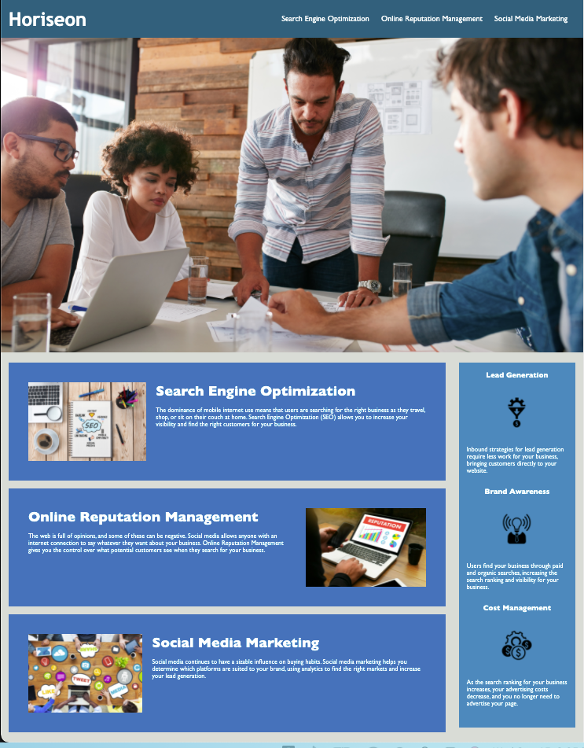

# Semantic

During this project we were giving a web page that did not meet accessiblility standards and were tasked with adding the semantic HTML elements to correct.  We were also asked to do some refactoring through both HTML and CSS files.

## Major Changes

* Corrected indentation
* Updated to semantic elements
* Renamed classes and ids to allow removal of repetitive code

## Built With

* [HTML](https://developer.mozilla.org/en-US/docs/Web/HTML)
* [CSS](https://developer.mozilla.org/en-US/docs/Web/CSS)

## Screen Shot

## Deployed Link

* [See Live Site](https://erikgustuson.github.io/Semantic/)

## Authors

* **Erik Gustuson** 

- [Link to Portfolio Site](https://github.com/ErikGustuson)
- [Link to Github](https://github.com/)
- [Link to LinkedIn](https://www.linkedin.com/in/erik-gustuson/)

## License

MIT License

Copyright (c) [2021] [Erik Gustuson]

Permission is hereby granted, free of charge, to any person obtaining a copy
of this software and associated documentation files (the "Software"), to deal
in the Software without restriction, including without limitation the rights
to use, copy, modify, merge, publish, distribute, sublicense, and/or sell
copies of the Software, and to permit persons to whom the Software is
furnished to do so, subject to the following conditions:

The above copyright notice and this permission notice shall be included in all
copies or substantial portions of the Software.

THE SOFTWARE IS PROVIDED "AS IS", WITHOUT WARRANTY OF ANY KIND, EXPRESS OR
IMPLIED, INCLUDING BUT NOT LIMITED TO THE WARRANTIES OF MERCHANTABILITY,
FITNESS FOR A PARTICULAR PURPOSE AND NONINFRINGEMENT. IN NO EVENT SHALL THE
AUTHORS OR COPYRIGHT HOLDERS BE LIABLE FOR ANY CLAIM, DAMAGES OR OTHER
LIABILITY, WHETHER IN AN ACTION OF CONTRACT, TORT OR OTHERWISE, ARISING FROM,
OUT OF OR IN CONNECTION WITH THE SOFTWARE OR THE USE OR OTHER DEALINGS IN THE
SOFTWARE.

## Acknowledgments

* Thanks Jerome, Every time i thought i was done you would give a hint and make me realize just how much more i can do and what i'm capable of.
* Thanks Cheng and Manuel for your positive words of encouagment.
